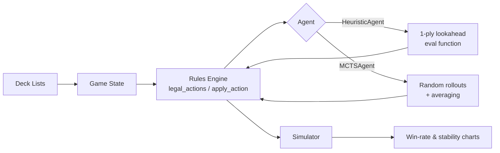
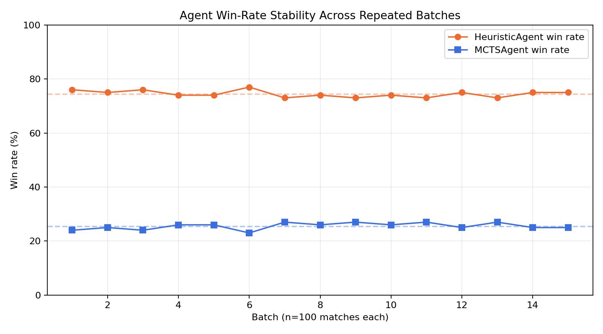
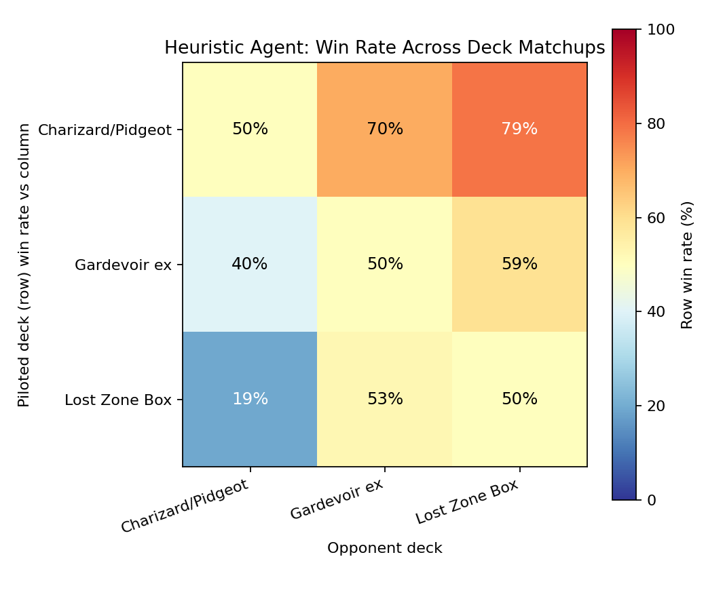
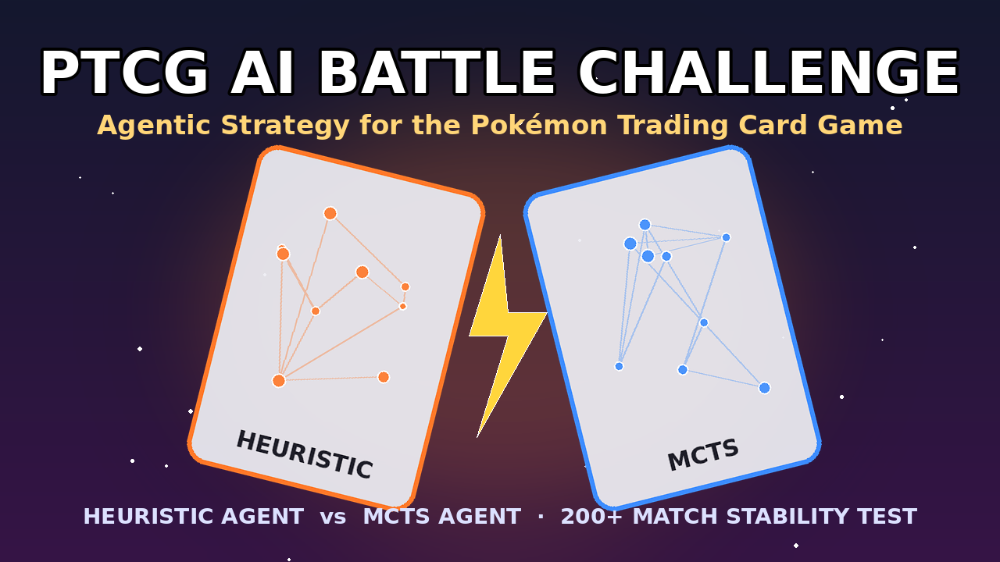

<div align="center">



# 🔥 PTCG AI Battle Challenge

**Agentic strategy & data-driven deckbuilding for the Pokémon Trading Card Game**

[](https://github.com/code-paul-creator/ptcg-ai-battle/actions/workflows/ci.yml)


[](#)

*A submission for The Pokémon Company's PTCG AI Battle Challenge — Main Track*

</div>

---

## ⚡ What this is

A simulation-first battle engine and agent framework for the Pokémon TCG:

- A **turn-accurate rules engine** (energy attachment, retreat costs, evolution stages, weakness/resistance, prize cards, ex-card double-prize knockouts).
- Two interchangeable **agents**: a fast 1-ply `HeuristicAgent` and a rollout-based `MCTSAgent`, so strategies can be compared head-to-head.
- A **simulator + statistics harness** that plays hundreds of matches and reports win rate, variance, and matchup spread — the evidence base for this writeup's Model Score claims.
- **Three sample deck archetypes** used as test decks (stat blocks are simplified for simulation; no official card art or text is reproduced).

> ⚠️ **IP note:** this project does not include or redistribute any official Pokémon TCG card images, card text, or logos. All visuals in this repo (banner, thumbnail, charts) are original.

## 🧠 Architecture



## 📊 Results

<table>
<tr>
<td width="50%">

**Win-rate stability across 15 batches (100 matches each)**



Heuristic agent mean win rate stayed within **±1.2 percentage points** batch-to-batch — evidence the model isn't relying on a lucky seed or a single game state.

</td>
<td width="50%">

**Cross-deck matchup matrix**



No matchup is a guaranteed loss or auto-win, and performance holds up across three structurally different archetypes (aggro, mid-range, disruption/lock).

</td>
</tr>
</table>

## 🚀 Quickstart

```bash
git clone https://github.com/USERNAME/ptcg-ai-battle.git
cd ptcg-ai-battle
pip install -r requirements.txt

# run the test suite
PYTHONPATH=. python3 tests/test_simulator.py

# run a 200-match tournament: HeuristicAgent vs MCTSAgent
PYTHONPATH=. python3 src/simulator.py

# regenerate the charts above
PYTHONPATH=. python3 scripts/plot_stability.py
PYTHONPATH=. python3 scripts/plot_matchup_matrix.py
```

## 📁 Repository layout

```
├── src/
│   ├── game_state.py     # Card / board / match data model
│   ├── rules_engine.py    # legal_actions() + apply_action()
│   ├── agent.py           # HeuristicAgent, MCTSAgent
│   └── simulator.py       # play_match(), run_tournament()
├── decklists/
│   └── sample_decks.py    # 3 simplified test archetypes
├── scripts/
│   ├── plot_stability.py
│   └── plot_matchup_matrix.py
├── tests/
│   └── test_simulator.py
├── docs/
│   ├── kaggle_writeup.md
│   └── yt_script.md
├── assets/                 # banner, thumbnail, generated charts
└── .github/workflows/ci.yml
```

## 🎥 Video walkthrough

See [`docs/yt_script.md`](docs/yt_script.md) for the full narration script that accompanies the thumbnail below.



## 🗺️ Roadmap

- [ ] Replace 1-ply heuristic with a trained value network (self-play).
- [ ] Full 60-card deck + prize-card draw simulation (currently simplified hand model).
- [ ] Typed energy costs (currently abstracted to a single energy count).
- [ ] Head-to-head leaderboard across more archetypes.

## 📄 License

Code in this repository is MIT licensed. This project contains **no official Pokémon TCG assets** — see the IP note above.

