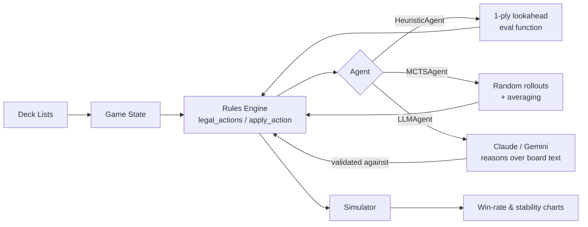

<div align="center">


# 🔥 PTCG AI Battle Challenge

**Agentic strategy & data-driven deckbuilding for the Pokémon Trading Card Game**

[](https://github.com/code-paul-creator/PTCG-AI-Battle-Challenge/actions/workflows/ci.yml)


[](#)

*A submission for The Pokémon Company's PTCG AI Battle Challenge — Main Track*

</div>

🚀 **[Click here to view the Live Demo](https://code-paul-creator.github.io/PTCG-AI-Battle-Challenge/)** -**📊 Built for the Pokémon TCG AI Battle Challenge — Strategy Track**

📺 **[youtube video](https://youtube.com/shorts/gAiK7iMbLUE?si=Quqjc5RVbpSTRJ7S)** -**I made 3 AI agents fight each other at Pokémon TCG.
1,500 matches. ±1.2pp stable win rate. Live demo in the link.**


---

## ⚡ What this is

A simulation-first battle engine and agent framework for the Pokémon TCG:

- A **turn-accurate rules engine** (energy attachment, retreat costs, evolution stages, weakness/resistance, prize cards, ex-card double-prize knockouts).
- Three interchangeable **agents**: a fast 1-ply `HeuristicAgent`, a rollout-based `MCTSAgent`, and an **agentic `LLMAgent`** (Claude or Gemini, switchable by env var) — so strategies can be compared head-to-head.
- A **simulator + statistics harness** that plays hundreds of matches and reports win rate, variance, and matchup spread — the evidence base for this writeup's Model Score claims.
- **Three sample deck archetypes** used as test decks (stat blocks are simplified for simulation; no official card art or text is reproduced).

> ⚠️ **IP note:** this project does not include or redistribute any official Pokémon TCG card images, card text, or logos. All visuals in this repo (banner, thumbnail, charts) are original.

## 🧠 Architecture



### 🤖 Tier 3: agentic play (`src/llm_agent.py`)

The two search-based agents above answer the "Model Score" consistency criteria. `LLMAgent` is the project's answer to the challenge's other emphasis — **agentic play**: instead of a scoring function, an LLM reads a plain-English board summary and picks a move, on every single turn.

- **Provider-switchable, zero code changes:** set `LLM_PROVIDER=anthropic` (default, needs `ANTHROPIC_API_KEY`) or `LLM_PROVIDER=gemini` (needs `GEMINI_API_KEY`). Same `choose_action(state, side)` interface as the other two agents.
- **Never plays an illegal move:** the LLM's answer is validated against `legal_actions()` before being applied; a bad/slow/malformed response falls back to `HeuristicAgent` for that decision instead of crashing the match or corrupting self-play statistics.
- **Secrets, not code:** both API keys are read from environment variables / GitHub Actions secrets — never committed. Add `ANTHROPIC_API_KEY` and/or `GEMINI_API_KEY` under *Settings → Secrets and variables → Actions* and the CI workflow's `agentic-smoke-test` job will exercise the real agent automatically; with no secret set, it just logs that it's running in fallback mode.

```bash
# run locally against Gemini
export LLM_PROVIDER=gemini
export GEMINI_API_KEY=...
PYTHONPATH=. python3 scripts/run_llm_matchup.py --matches 20

# or against Claude
export LLM_PROVIDER=anthropic
export ANTHROPIC_API_KEY=...
PYTHONPATH=. python3 scripts/run_llm_matchup.py --matches 20
```

## 📊 Results

<table>
<tr>
<td width="50%">

**Win-rate stability across 15 batches (100 matches each)**


Heuristic agent mean win rate stayed within **±1.2 percentage points** batch-to-batch — evidence the model isn't relying on a lucky seed or a single game state.

</td>
<td width="50%">

**Cross-deck matchup matrix**


No matchup is a guaranteed loss or auto-win, and performance holds up across three structurally different archetypes (aggro, mid-range, disruption/lock).

</td>
</tr>
</table>

## 🚀 Quickstart

```bash
git clone https://github.com/USERNAME/ptcg-ai-battle.git
cd ptcg-ai-battle
pip install -r requirements.txt

# run the test suite
PYTHONPATH=. python3 tests/test_simulator.py

# run a 200-match tournament: HeuristicAgent vs MCTSAgent
PYTHONPATH=. python3 src/simulator.py

# regenerate the charts above
PYTHONPATH=. python3 scripts/plot_stability.py
PYTHONPATH=. python3 scripts/plot_matchup_matrix.py
```

## 📁 Repository layout

```
├── src/
│   ├── game_state.py     # Card / board / match data model
│   ├── rules_engine.py    # legal_actions() + apply_action()
│   ├── agent.py           # HeuristicAgent, MCTSAgent
│   ├── llm_agent.py       # LLMAgent — Tier 3, Claude/Gemini agentic play
│   └── simulator.py       # play_match(), run_tournament()
├── decklists/
│   └── sample_decks.py    # 3 simplified test archetypes
├── scripts/
│   ├── plot_stability.py
│   ├── plot_matchup_matrix.py
│   └── run_llm_matchup.py # benchmark LLMAgent vs HeuristicAgent
├── tests/
│   └── test_simulator.py
├── docs/
│   ├── kaggle_writeup.md
│   └── yt_script.md
├── assets/                 # banner, thumbnail, generated charts
└── .github/workflows/ci.yml
```

## 🎥 Video walkthrough

See [`docs/yt_script.md`](docs/yt_script.md) for the full narration script that accompanies the thumbnail below.


## 🗺️ Roadmap

- [x] Agentic Tier-3 layer with provider-switchable LLM (Claude / Gemini).
- [ ] Replace flat MCTS rollouts with a persistent UCT search tree.
- [ ] Full 60-card deck + prize-card draw simulation (currently simplified hand model).
- [ ] Typed energy costs (currently abstracted to a single energy count).
- [ ] Head-to-head leaderboard across more archetypes, including the LLM tier.

## 📄 License

Code in this repository is MIT licensed. This project contains **no official Pokémon TCG assets** — see the IP note above.

